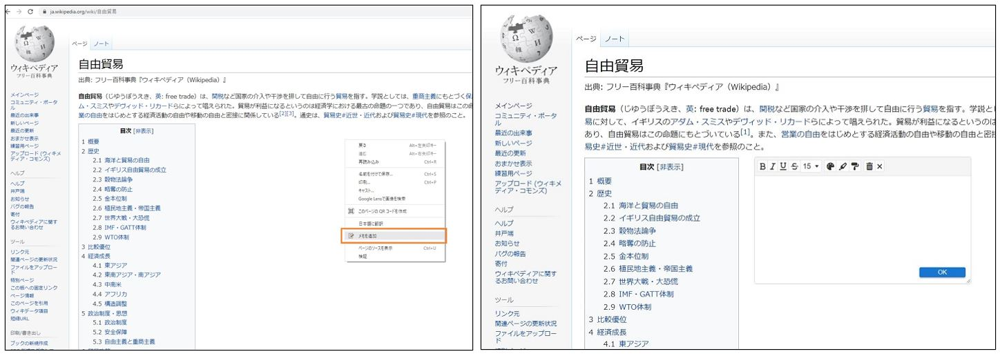
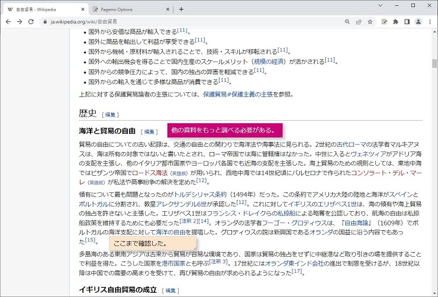
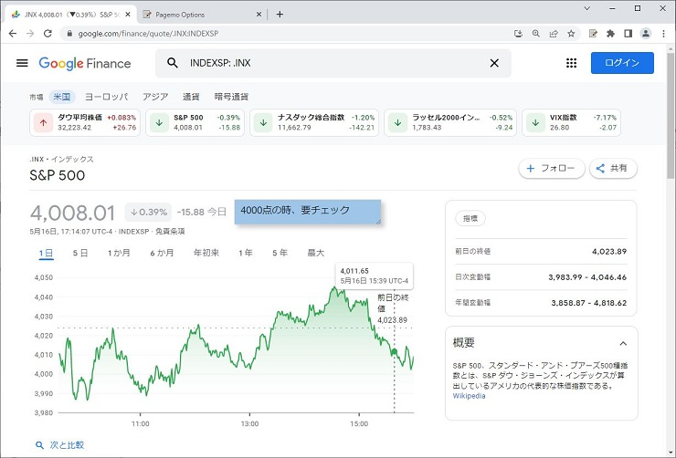
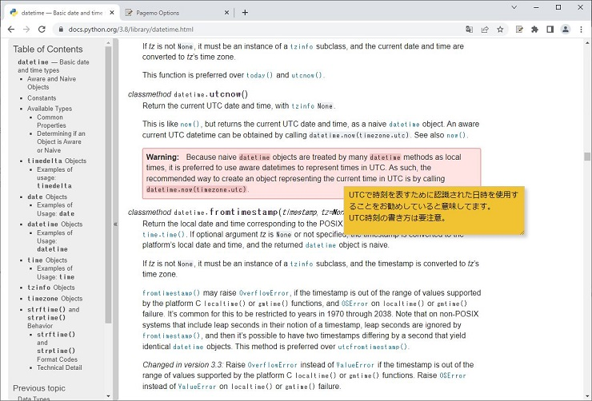
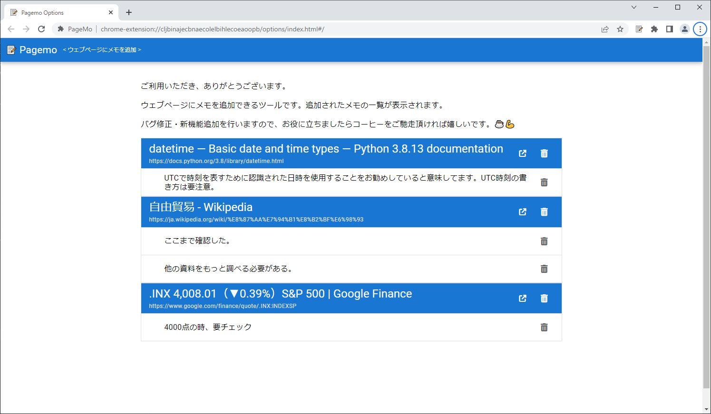

# PageMo
Google Chrome　の拡張機能です。

任意のウェブページにメモを追加、メモをページ内に任意の場所に配置できます。 

ウェブページを再開しても追加したメモが表示されます。

メモを編集するエディタでフォートサイズ、マーカー、背景色など設定ができます。

拡張機能のオプションで全メモの一覧が表示されます。

オプション画面はVue.js、Quasarで開発しました。その以外の画面、JQueryで実装してます。

chrome web store
https://chrome.google.com/webstore/detail/pagemo/pofjbbchhigcnknnkohmonholngahbgk?utm_source=chrome-ntp-icon

### メモ編集エディタの機能
- 太字、斜体、下線、取り消し線、フォートサイズの設定
- マーカー色、文字色、背景色の設定
- メモの削除、エディタを閉じる、OKボタンでメモを編集完了

### メモ表示
- ドラッグドロップでメモを移動
- マウスをメモの右下あたりに置くとサイズ調整アイコンが表示され、サイズ調整ができます。

### メモ一覧表示画面
- PageMo拡張機能のメニュー「メモ一覧を表示」を押すとメモ一覧画面が表示されます。
- PageMo拡張機能のオプション画面で追加したメモの一覧が表示されます。
- 追加したすべてのメモと対象サイトが表示されます。
- ゴミ箱アイコンでメモを削除、サイトごとでメモを削除できます。

拡張機能のオプションで全メモの一覧が表示されます。

※業務委託の関係者がソースを確認するため、リポジトリをパブリックしています。その以外のご利用はご遠慮ください。
